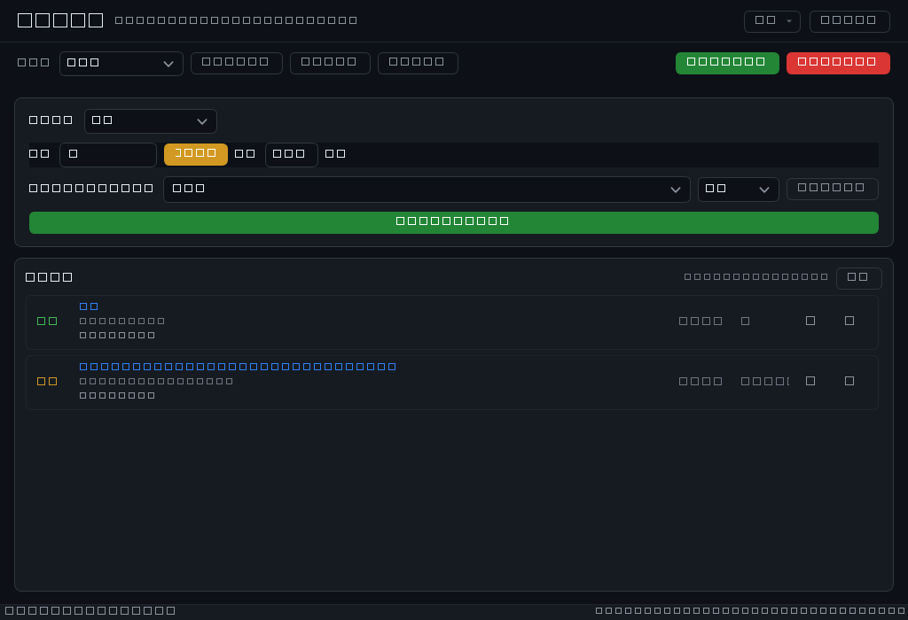
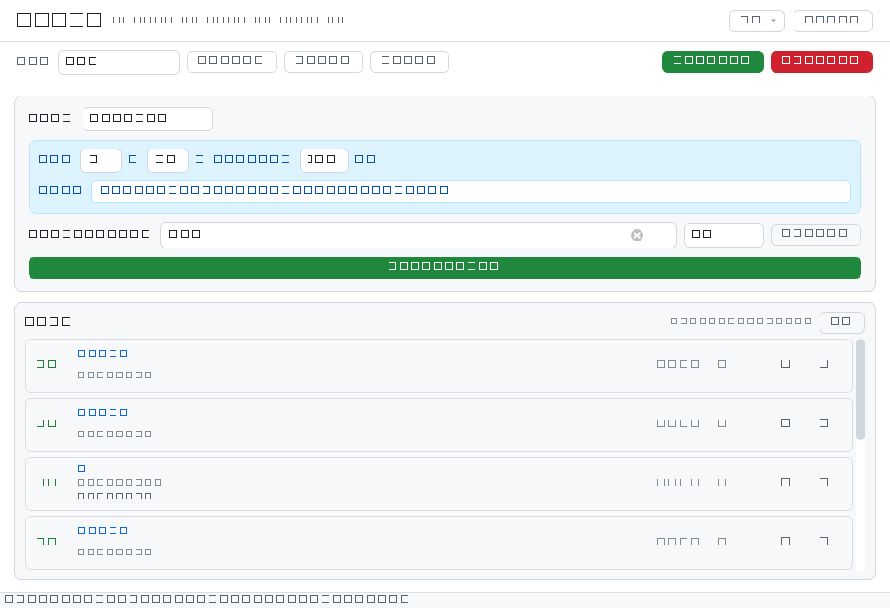

<p align="center">
  
</p>

# 键盘连点器 KeyClicker

一个用 **Python + PyQt6** 编写的 Windows 键盘连点 / 定时按键工具。支持连点、定时序列、多配置页、**前台窗口匹配锁定**与**后台投递（不抢焦点，窗口挂后台也能操作）**，连点按键与按键序列都可以**按下即录入**（无需手写键名），并提供全局热键与紧急停止。


> 纯本地程序：不联网、不上传任何数据、无需注册任何账号或密钥。

## 界面预览

| 深色主题 | 浅色主题 |
| --- | --- |
|  |  |

---

## 功能特性

### 连点模式
- 按固定间隔持续发送指定按键，间隔下限 16 ms（约 60 次/秒）
- 支持组合键：`ctrl+f9`、`ctrl+shift+a`、`alt+1` …
- 「● 录入」按钮：按下键盘上任意按键（或组合键）即可录入，Esc 取消录入
- 实时显示已发送次数，可随时暂停 / 继续 / 停止

### 定时序列
- 设定「分 + 秒」倒计时，到点后按顺序依次发送一串按键（如 `f5 → 1 → 2 → enter`）
- 序列中每一步都支持组合键，步骤之间可设置间隔（下限 16 ms，0 表示同时按下）
- 支持循环触发，显示本次剩余时间与已触发次数
- 序列编辑器支持「● 开始录入」逐个按键录入，也支持手动输入 / 逗号分隔批量输入
- 「按键序列」整块用强调色底托起，浅色与深色主题下都能一眼看清这块是序列设置

### 前台窗口匹配锁定
- 每个任务都可以设置「仅在指定窗口处于前台时才生效」，避免切到别的窗口后误按键
- 匹配方式三种：**包含**（默认，窗口标题包含关键词即可）、**精确**（标题完全一致）、**正则**（`re.search` 语法，大小写不敏感）
- 关键词留空即不限制；非法正则表达式会在添加任务时给出中文提示，不会被接受
- 「抓取当前窗口」按钮：点击后有 **3 秒倒数**（按钮显示「3 秒…」），倒数结束再抓取当前前台窗口标题，并在状态栏提示抓到的是什么程序的窗口
- 抓取时会**拒绝记录本程序自己的窗口**——如果不是在倒数期间切到目标窗口，会弹出中文提示而不是填进一个没用的标题
- 关键词输入框是**可编辑下拉框**：点开即列出当前所有可见窗口标题，直接选一个即可，也可以自己手输关键词
- 任务运行中如果当前前台窗口不匹配：连点照常走节拍但**一个键都不发**、次数不增长；定时任务倒计时照常走但**到点不触发**，任务行上会显示「窗口不匹配」提示

### 后台投递（绑定窗口，不抢焦点）
- 每个任务有「生效方式」三选一：

  | 生效方式 | 行为 |
  | --- | --- |
  | **前台匹配**（默认） | 只在指定窗口处于前台时才真的按键，其它窗口在前台时一个键都不发 |
  | **同进程** | 当前前台窗口和绑定的目标属于同一个进程时才发送 |
  | **绑定窗口** | **完全不看前台是谁**：直接把按键投递给绑定的那个窗口 |

- 选「绑定窗口」后，**窗口可以在后台、焦点不在它上面，照样能执行操作**——你可以一边挂机一边正常用电脑，前台窗口全程不会被抢走、不会闪一下、不会打断你正在打的字
- 绑定的是**窗口 + 它所属的进程**（同时记下窗口句柄、进程 ID、进程名）：目标程序关掉再打开，句柄失效了会按「同进程 + 标题关键词」自动重新找到新窗口，不用重新抓取
- 目标绑定来自「抓取当前窗口」按钮，但仍然以**前台窗口**作为选择来源：先切到目标窗口，再点抓取
- 任务行上会实时显示状态：「后台投递：游戏.exe」表示正在往那个窗口投递；绑定窗口找不到时显示「未发送：绑定的窗口已关闭或找不到」
- **局限（重要）**：这条路径走的是 Windows 窗口消息（`PostMessage`），只有用标准消息循环接收按键的程序才吃这套。用 **DirectInput / 原始输入（Raw Input）** 的游戏收不到投递——那种游戏只能用「同进程」方式，且需要目标在前台。另外因为窗口消息不改变真实键盘状态，依赖 `Shift` / `Ctrl` 才能打出的大写字母与组合字符在部分目标里可能走样（`ctrl+a` 可能被当成普通字符 `a`）
- 本程序**不会**调用 `SetForegroundWindow` 一类的接口去抢前台，源码里有回归用例盯着这件事

### 浅色 / 深色主题
- UI 采用 GitHub Primer 风格：1px 边框、6–8px 圆角、13px 正文、标题 600 字重、页头与状态栏 1px 分隔线
- 顶部「切换到浅色 / 切换到深色」按钮一键整窗换肤，选择会被保存
- 首次运行跟随系统主题（读取 Windows 个性化设置），读取失败时默认深色
- 主题由主题字典 + 动态生成样式表实现，控件不写死颜色，因此换肤是即时且完整的
- 任务类型、配置页、窗口匹配等下拉框在浅色 / 深色下都有悬停高亮与提示（悬停变底色 + 强调色边框），并有中文工具提示
- 下拉框全部**圆角化**：弹出列表是无边框 + 半透明的圆角浮层，列表项选中为圆角高亮块，当前项右侧带圆润对勾，下拉按钮是自绘的圆角箭头（悬停 / 展开时变强调色），界面里没有 PyQt 默认的直角方框
- 复选框与单选框指示器同样是圆角的，选中时填充强调色，悬停有描边反馈
- 状态栏右侧**常驻**显示当前生效的全局热键，临时状态消息不会把它顶掉
- 所有输入框 / 下拉框点一下窗口空白处就会自动失去焦点，不会留下多余的聚焦外框
- 界面字体统一为系统中文界面字体，「点击设置序列」等中文按钮与状态文字不再落到等宽字体上

### 多配置页
- 多套互不干扰的独立配置页，可新增 / 重命名 / 删除
- 任何改动自动保存，配置写入采用「临时文件 + 原子替换」，断电或崩溃不会写坏配置
- 兼容旧版本配置文件（旧版顶层数组格式、未知字段、缺失的新字段都会被安全处理）

### 全局热键
| 热键 | 作用 |
| --- | --- |
| `Ctrl` + `` ` `` | 开始 / 停止**当前页**的全部任务 |
| `F6` | **紧急停止**：停止所有页面的全部任务 |

> 正在录入按键时，全局热键会自动暂时失效——这样你才能把 `F6` 本身录成连点键。

---

## 快速开始

### 方式一：下载打包好的 exe（推荐）

1. 打开 [Releases](../../releases/latest) 页面
2. 下载 `KeyClicker.exe`
3. 双击运行（**建议右键 → 以管理员身份运行**，见下方 FAQ）

exe 为单文件绿色版（约 26 MiB），无需安装 Python。配置默认保存在 **exe 同目录**的 `clicker_config.json`，方便随身携带（详见下方「配置文件位置」）。

### 方式二：从源码运行

```bash
pip install -r requirements.txt
python keyclicker.py
```

要求 Python 3.9+（开发环境为 Python 3.14）。

---

## 使用说明

1. **连点**：点击按键输入框旁的「● 录入」→ 按下想连点的按键（或组合键）→ 设置间隔（毫秒）→ 需要时选择「生效方式」并填写窗口关键词 → 点「添加到任务列表」。
2. **定时序列**：点「点击设置序列」→ 用「● 开始录入」逐个按下按键，或在输入框手动输入（支持 `ctrl+f9, 1, enter` 这种逗号分隔写法）→ 回到面板设置分 / 秒与间隔 → 点「添加到任务列表」。
3. **窗口相关设置**：添加任务卡片上有两个下拉框——「生效方式」决定这个任务什么时候才真的按键（前台匹配 / 同进程 / 绑定窗口），下面一行「仅在前台窗口匹配时生效」填关键词、选匹配方式；不确定当前窗口标题时点「抓取当前窗口」自动填入，抓完会自动切成「绑定窗口」。关键词留空表示不限制。
   - 想让**窗口留在后台、自己继续用电脑**：先切到目标窗口点「抓取当前窗口」，再把「生效方式」确认为「绑定窗口」，添加后任务行会显示「后台投递：xxx.exe」。
4. **多套配置**：顶部操作栏「＋ 新建配置页」新增，`✎` 重命名，`✕` 删除页面，改动自动保存。
5. **主题与选项**：顶部「切换到浅色 / 切换到深色」切换主题；「选项」菜单内可「打开配置目录」和查看「关于」。
6. **按键名写法**：使用 `keyboard` 库的规范名，常见别名会自动转换 —— `win` / `super` / `cmd` → `windows`，`control` → `ctrl`，`pgup` → `page up`，`ins` → `insert`，`prtscn` → `print screen`。无法识别的键名会给出中文提示，不会静默失败。

---

## 配置文件位置

**v1.2.4 起默认就是便携模式**：配置存在程序自己旁边，换电脑连同 exe 一起拷走就不会丢。

| 顺序 | 位置 | 什么时候用 |
| --- | --- | --- |
| 1 | 环境变量 `KEYCLICKER_CONFIG` 指定的路径 | 你手动指定了就用它（优先级最高） |
| 2 | 程序目录下已有的 `clicker_config.json` | 已经在用便携配置，继续用这个 |
| 3 | 程序目录 `clicker_config.json` | **默认**。程序目录可写时（绿色版 / 解压即用）就用它 |
| 4 | `%APPDATA%\KeyClicker\config.json` | 只在程序目录**不可写**时兜底（例如装在 `C:\Program Files` 下） |

「程序目录」指 exe 所在目录（源码运行时是脚本目录）。

- **换电脑**：把 exe 和同目录的 `clicker_config.json` 一起拷过去，任务、序列、主题全都在
- **从旧版本升级**：如果便携位置还没有配置，程序会**自动把 `%APPDATA%` 里的旧配置复制过来**，不会出现"任务全没了"（只复制不删除，旧文件仍保留）
- 不写注册表、不写系统目录；配置写入采用「临时文件 + 原子替换」，断电或崩溃不会写坏配置
- 程序目录只读时自动退回 `%APPDATA%`，不会因为写不进去而报错或丢配置

> 「选项」→「打开配置目录」可以直接打开配置所在文件夹，一眼看到配置到底存在哪。

---

## 常见问题（FAQ）

**Q：为什么在游戏里按键没反应？**
A：分两种情况看。**游戏要求在前台才有效**时，把任务的「生效方式」改成**同进程**并让游戏在前台，同时以**管理员身份**运行本程序。如果想让游戏留在后台、你继续用电脑干别的，就选**绑定窗口**——但它走的是 Windows 窗口消息，只有用标准消息循环收按键的程序才吃这套；使用 **DirectInput / 原始输入（Raw Input）** 的游戏（多数 3D 游戏）收不到窗口消息，这类游戏只能用「同进程」+ 前台，或者用驱动级方案，本工具无法绕过。

**Q：录入了却没反应 / 提示"启动键盘钩子失败"？**
A：`keyboard` 库的全局钩子需要足够权限，请右键「以管理员身份运行」。此时仍可在输入框手动输入键名。

**Q：Windows Defender / 杀毒软件报毒？**
A：PyInstaller 打包的单文件 exe 被启发式误报很常见。可自行从源码打包（见下），或直接以源码方式运行。

**Q：配置文件在哪？会写入系统目录吗？**
A：v1.2.4 起默认就在程序自己旁边（`clicker_config.json`），不写注册表、不写系统目录；程序目录只读时才退回 `%APPDATA%\KeyClicker\config.json`。详见上方「配置文件位置」。

**Q：设了窗口匹配，任务显示"窗口不匹配"怎么办？**
A：说明当前前台窗口标题没有命中你填的关键词。可以点「抓取当前窗口」重新获取准确标题，或改用「包含」模式只填标题里的一段关键词；「精确」模式要求标题完全一致。如果本来就不希望它看前台是谁，把「生效方式」改成**绑定窗口**即可。

**Q：用了「绑定窗口」，任务显示"未发送：绑定的窗口已关闭或找不到"？**
A：目标程序关掉了。重新打开程序后按「抓取当前窗口」再抓一次即可（如果绑定信息里的进程名和标题关键词还能命中，程序也会自动重新找到新窗口）。

**Q：热键没生效？**
A：`` Ctrl+` `` 可能被其他软件占用，或程序权限不足（需与目标窗口同级或更高权限）。

**Q：会记录我的按键历史吗？**
A：不会。键盘钩子只在点击「录入」期间临时开启、录入完成立即卸载，按键不落盘、不外发；程序本身也不联网。

---

## 从源码打包 exe

```bash
pip install pyinstaller PyQt6 keyboard
python -m PyInstaller KeyClicker.spec
```

产物为 `dist/KeyClicker.exe`（单文件、无控制台窗口）。也可以直接运行 `build.bat`。

> 提示：打包后的 exe 可以放在任意目录运行，配置默认写在 **exe 同目录**的 `clicker_config.json`（便携），换电脑连 exe 一起拷走即可；只有 exe 所在目录不可写时才退回 `%APPDATA%\KeyClicker\`。

---

## 测试

```bash
python -m unittest discover -s tests -v
```

共 124 个用例，覆盖：按键名解析与校验、连点/定时任务的启停与节拍、前台窗口匹配（包含/精确/正则/空关键词/非法正则/大小写）、窗口锁定下不下发按键、**后台投递（三种生效方式的分流、绑定窗口不走全局注入、组合键消息序列与 `lParam` 标记、Alt 走 `WM_SYSKEY`、换绑清缓存、句柄失效后按进程重找、存盘往返、"源码里不许出现抢前台调用"的护栏）**、主题生成与切换持久化、配置文件路径优先级（环境变量 / 便携模式 / 用户目录 / 只读兜底 / 旧配置迁移）、配置往返与旧格式兼容、按键录入器（组合键、长按去重、Esc 取消、修饰键忽略）、界面构建与热键行为、界面细节（序列区配色令牌、下拉框悬停样式、窗口下拉框行为、点空白处失焦、图标加载）、圆角下拉与自绘箭头（像素级断言）、列表项选中高亮与对勾、下拉弹层圆角卡片（四角透明像素断言）、序列区实线边框、状态栏常驻热键提示、窗口抓取倒数与自我保护。测试使用 Qt 的 `offscreen` 平台，无需显示器，也不会读写真实的用户配置目录。

---

## 项目结构

```
keyclicker.py              主程序（单文件，约 2640 行）
KeyClicker.spec            PyInstaller 打包配置
logo.png / logo.ico        程序图标（打包进 exe，作为窗口与任务栏图标）
docs/logo.svg              Logo 源文件（矢量）
docs/screenshot.png        界面截图（深色主题）
docs/screenshot-light.png  界面截图（浅色主题）
tests/test_keyclicker.py   单元测试（124 个用例，标准库 unittest）
requirements.txt           运行依赖
build.bat                  一键打包脚本
```

---

## 更新日志

### v1.2.4
- **新增**：任务的「生效方式」增加**绑定窗口**——绑定之后**完全不看前台是谁**，直接把按键投递给目标窗口。窗口在后台、焦点不在它上面也能执行操作，**不抢焦点、不切前台**，可以一边挂机一边正常用电脑（为了多开）
- **新增**：绑定的是**窗口 + 它所属的进程**（同时记下窗口句柄、进程 ID、进程名）。目标程序重开后旧句柄失效，会按「同进程 + 标题关键词」**自动重新找到新窗口**，不必重新抓取；任务行实时显示「后台投递：xxx.exe」或「未发送：绑定的窗口已关闭或找不到」
- **调整**：抓取窗口后自动从「前台匹配」切到「绑定窗口」，抓完即用；选择「绑定窗口」但没绑定时禁止添加任务并给出中文提示
- **修复**：**配置不再是"换台电脑就丢"**——v1.2.4 起默认写成**便携配置**，存在 exe 旁边的 `clicker_config.json`，连 exe 一起拷走配置就在；程序目录只读时（如装在 `C:\Program Files`）自动退回 `%APPDATA%`。从旧版本升级时会把 `%APPDATA%` 里的旧配置**自动迁移**过来，不会"任务全没了"（只复制不删除）
- **修复**：「点击设置序列」文字发虚——原因是在「微软雅黑 UI」上 600/700 会落到真正的 Bold（该字体只有 Regular/Light/Bold 三档），13px 中文一加粗笔画就发糊。改为统一的界面字体 + 字重 500（实际回落 Regular），未设置序列时文字改用最实的前景色，不再靠浅色压浅底
- **优化**：明确了「绑定窗口」的适用边界，README 与界面提示都写清：这条路径走窗口消息，**DirectInput / 原始输入的游戏收不到**，那种游戏只能用「同进程」+ 前台
- **优化**：新增 16 个回归用例（三种生效方式的分流、`post_keys` 消息序列与 `lParam` 标记、Alt 走 `WM_SYSKEY`、绑定与换绑清缓存、句柄失效后按进程重找、存盘往返、**"源码里不许出现抢前台调用"的护栏断言**），测试总数 108 → **124**

### v1.2.3
- **修复**：下拉弹层外圈仍有**突兀的直角方框**（浅色主题下是白色底板 + 灰色方框，深色主题下框虽暗但仍可见）——弹层容器改为**自绘圆角卡片**：拦截容器自身的绘制事件，用抗锯齿画一张与主题一致的 9px 圆角卡片，圆角以外的像素保持透明，四角是真正的弧线，方角与方框彻底消失
- **修复**：弹层圆角在部分情况下失效（Qt 会重建弹出容器）——每次展开前重新确认弹层外观，反复开关下拉都保持圆角
- **优化**：列表背景改透明、由圆角卡片统一托底，长列表的滚动箭头不受影响，仍正常显示
- **优化**：新增 7 个回归用例（弹层四角透明像素断言、卡面颜色跟随主题、容器半透明与过滤器挂载、反复展开不失效、过滤器只接管绘制事件、绘制异常回退、滚动箭头仍可见），测试总数 101 → **108**

### v1.2.2
- **修复**：深色主题下「按键设置序列」区域几乎看不出边框——序列区与「点击设置序列」按钮改为**实线强调色边框**（浅色 `#54aeff` / 深色 `#388bfd`），底色保留，两种主题下边界都清晰可见，同时界面中不再有任何虚线框
- **优化**：所有下拉框（任务类型 / 配置页 / 窗口匹配）**彻底圆角化**：弹出列表改为无边框 + 半透明的圆角浮层，列表项选中改为圆角高亮块，当前项右侧显示圆润对勾，不再出现 PyQt 默认的直角方框
- **修复**：下拉按钮（小三角）在浅色 / 深色下都看不清——改为自绘圆角箭头，悬停 / 展开 / 聚焦时变强调色，并压掉系统默认箭头与弹出容器的方角背景
- **优化**：复选框 / 单选框指示器改为圆角并统一配色（选中填充强调色，悬停描边反馈）
- **修复**：底部快捷键提示会被临时状态消息顶掉——热键提示改为状态栏**常驻**控件，临时消息不再覆盖它，并反映实际注册结果（失败时提示以管理员身份运行）
- **修复**：抓取前台窗口容易抓到本程序自己的窗口——新增 3 秒倒数（按钮显示「3 秒…」），倒数结束后抓取，并**拒绝写入本程序自身的窗口**，状态栏同时显示抓到的进程名
- **优化**：下拉框去掉「〇 连点」里的假单选圈；窗口下拉框、配置页下拉框统一为同一套圆角风格
- **优化**：新增 17 个界面回归用例（圆角弹层、箭头像素、选中高亮像素、序列区实线边框、常驻提示、倒数抓取与自我保护），测试总数 84 → **101**

### v1.2.1
- **新增**：**软件图标**——矢量 Logo（`docs/logo.svg`，键帽 + 连续触发弧线，GitHub Primer 蓝渐变），并导出 `logo.png` / `logo.ico` 作为窗口与任务栏图标
- **新增**：窗口匹配关键词改为**可编辑下拉框**，点开即列出当前所有可见窗口标题（自动过滤隐藏窗口、输入法窗口与本程序自身），选中即填，也支持继续手输
- **新增**：点窗口空白处自动让输入框 / 下拉框失去焦点，不再残留聚焦外框
- **修复**：浅色主题下「按键序列」区域与卡片底色相同、看不出边界的问题——序列区改为独立的强调色底 + 边框（浅色淡蓝、深色深蓝），整体成块托起
- **修复**：「点击设置序列」「已连点 N 次」「等待按键…」等中文文字误用等宽字体（Consolas 无中文，回退字体不统一）导致的违和感，统一改回界面字体
- **修复**：下拉框（任务类型 / 配置页 / 窗口匹配）没有鼠标悬停反馈，且浅色主题下可编辑下拉会出现"框中框"与残留聚焦边框
- **优化**：下拉框补齐悬停高亮、中文工具提示与手型光标；未填充状态的「点击设置序列」按钮也有明确的悬停反馈
- **优化**：新增 12 个界面细节回归用例（序列区配色令牌、样式表规则、窗口下拉框行为、点空白失焦、图标加载），测试总数 72 → **84**

### v1.2.0
- **新增**：**前台窗口匹配锁定**——可为每个任务设置「仅在指定窗口处于前台时才生效」，支持包含 / 精确 / 正则三种匹配方式，并可一键「抓取当前窗口」
- **新增**：**浅色 / 深色双主题**（GitHub Primer 配色），顶部一键切换并记住选择；首次运行跟随系统主题
- **新增**：配置默认写入 `%APPDATA%\KeyClicker\config.json`，程序目录不再产生任何新文件；支持便携模式（`portable.flag` 或程序目录已有 `clicker_config.json`）与环境变量 `KEYCLICKER_CONFIG`
- **新增**：「选项」菜单（打开配置目录 / 关于），「关于」中显示版本、配置路径、热键与"纯本地程序，不联网"说明
- **新增**：`timeBeginPeriod(1)` 提升计时精度，退出时自动恢复
- **优化**：UI 全面重做为 GitHub Primer 风格（1px 边框、圆角、字重层次、页头与状态栏分隔线）
- **优化**：样式改为「动态属性 + 样式表属性选择器」，主题切换只需重新应用一次样式表
- **优化**：轮询刷新只在数值真正变化时才更新控件，减少无谓重绘
- **优化**：打包配置裁剪（排除用不到的 Qt 插件与翻译文件、标准库冗余模块，并开启字节码优化），单文件体积 **37.1 MiB → 25.8 MiB（-30%）**；实测冷启动约 **1.3 s → 1.15 s**（其中程序自身初始化只需约 0.2 s，其余是单文件自解压）
- **优化**：窗口标题匹配采用轻量 Win32 调用（仅在任务发送按键前读取一次），不额外开线程
- **优化**：新增按键任务时校验正则表达式，非法时给出中文提示

### v1.1.0
- **新增**：连点模式按键录入（「● 录入」按钮，按下即录入，支持组合键）
- **新增**：`F6` 全局紧急停止；录入期间自动屏蔽全局热键
- **修复**：按键序列录制时**组合键丢失修饰键**——Windows 钩子返回的是带方向的键名（`left ctrl` / `left shift` / `left windows`），旧代码只判断 `ctrl` / `shift`，导致 `Ctrl+F5` 只能录到 `f5`；现在统一交由 `keyboard.get_hotkey_name()` 归一化
- **修复**：长按按键触发系统自动重复，序列被同一个键刷屏
- **修复**：定时任务暂停后恢复会立刻触发一次
- **修复**：重复点击「开始」可能残留两个连点线程同时发键
- **修复**：重命名 / 删除配置页后界面跳回第一页
- **修复**：全局热键回调在钩子线程内直接操作 Qt 控件，偶发崩溃（改为信号转主线程）
- **修复**：配置写入非原子，异常退出可能损坏配置文件
- **修复**：打包为 exe 后配置写到临时解压目录，重启即丢失
- **修复**：缺少依赖时直接抛异常退出，改为弹窗提示安装命令
- **优化**：连点与定时改为固定节拍推进，长时间运行不累积漂移
- **优化**：按键名校验与中文错误提示，替代静默失败
- **优化**：状态栏热键提示、页面切换与轮询刷新更省资源

### v1.0.0
- 首个版本：PyQt6 重构版（连点 + 定时序列 + 多配置页）

---

## 免责声明

本工具仅用于**自动化重复性操作**（如办公软件批量录入、测试环境模拟按键）。请遵守目标软件 / 游戏的服务条款，因使用本工具产生的一切后果由使用者自行承担。

## 许可证

[MIT](LICENSE)
